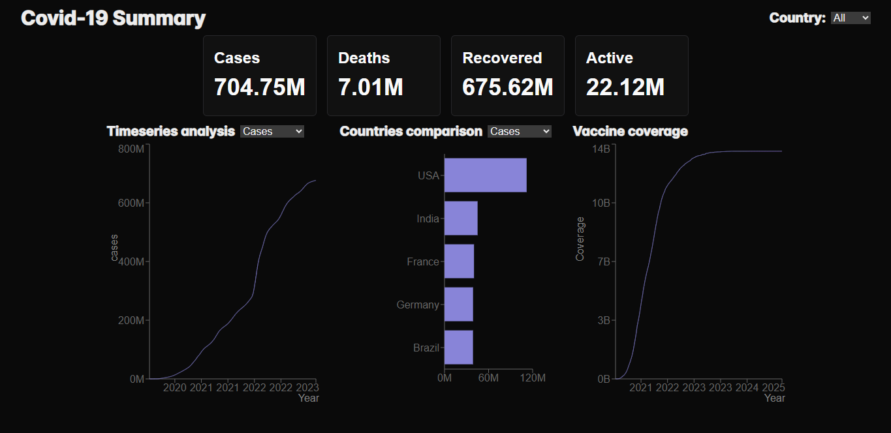

# 🦠 Covid-19 Summary Dashboard

A responsive web dashboard visualizing global COVID-19 statistics using data from the [disease.sh](https://disease.sh) API. Built with **React (Next.js + TypeScript)** and **Recharts** for interactive and informative visualizations.

## 📷 Preview



## 📊 Features

- **Global Overview**: Total cases, deaths, recoveries, and active cases.
- **Time Series Analysis**: Interactive graph for tracking cases, deaths, or recoveries over time.
- **Country Comparison**: Horizontal bar chart comparing top countries by selected metric.
- **Vaccine Coverage**: Cumulative vaccination progress over time.
- **Dark Theme UI**: Clean and modern dark mode interface.

## 🚀 Tech Stack

- **Framework**: [Next.js](https://nextjs.org/)
- **Language**: TypeScript
- **Charts**: [Recharts](https://recharts.org/)
- **API**: [disease.sh](https://disease.sh/docs/#/)

## 🛠️ Installation

```bash
git clone https://github.com/kelvinleandro/recharts-covid-summary.git
cd recharts-covid-summary
npm install
npm run dev
```

## 📝 License

This project is open-source under the MIT License.
